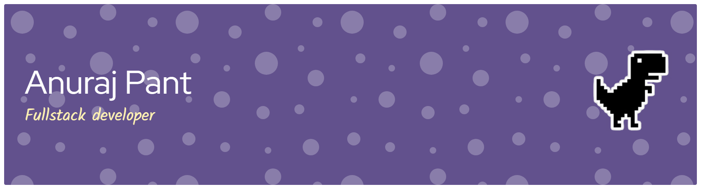

<!-- ====== HEADER BANNER ====== -->
<p align="center">
  
</p>

<!-- ====== TYPING ANIMATION ====== -->
<p align="center">
  <a href="https://anurajpant.com.np">
    
  </a>
</p>

<!-- ====== SOCIAL BADGES ====== -->
<p align="center">
  <a href="https://anurajpant.com.np"></a>
  <a href="https://linkedin.com/in/anuraj235"></a>
  <a href="mailto:anurajpant.cs@gmail.com"></a>
  <a href="https://github.com/Anuraj235"></a>
  
</p>

---

### 🧠 About

I'm an **AI Native Software Developer @ Townsend** — I build modern, scalable applications where AI is a first-class part of the architecture, not an afterthought. My work spans full-stack product engineering, applied AI (RAG, vector search, embeddings), and clean, maintainable systems that ship to production.

```ts
const anuraj = {
  role:      "AI Native Software Developer @ Townsend",
  focus:     ["Full-Stack", "Applied AI / RAG", "Product Engineering"],
  stack:     ["React", "TypeScript", ".NET", "Node.js", "Python"],
  ai:        ["RAG", "Vector Search", "Embeddings", "LLMs", "NLP"],
  mindset:   "Polished UI/UX • Clean architecture • Real-world impact",
};
```

---

### 🛠️ Tech Stack

**Languages**


**Frontend**


**Backend**


**AI / ML**


**Cloud / DevOps / Data**


---

### 🚀 Featured Projects

| Project | Stack | Description |
| :------ | :---- | :---------- |
| 🎬 **[Lion's Den Theaters](https://github.com/Anuraj235/Lions-Den-Theaters)** | React · TS · .NET · SQL Server | Full-stack ticketing platform with real-time seat booking, QR tickets, and an admin panel. |
| 🛰️ **[NASA Films](https://github.com/Anuraj235/Nasa-Films)** | ASP.NET MVC · React | Movie booking web app with seat selection and a CMS-style admin. |
| 🤖 **[RAG Observable](https://github.com/Anuraj235/rag-observable)** | FastAPI · ChromaDB · React | Transparent AI assistant — a RAG pipeline with trust metrics and chunk-level evidence. |
| 💬 **[Message Exchange System](https://github.com/Anuraj235/message-exchange-system)** | Node.js · MongoDB | Topic-based messaging with threads, comments, subscriptions, and a dashboard UI. |
| 🎞️ **ClipFlick** `soon` | Python · FFmpeg · AssemblyAI · ElevenLabs | AI shorts generator — auto clip, caption, and voiceover engine. |
| ⚖️ **NorthOaks AI Contract Expert** `soon` | Python · RAG · Vector DB · .NET · React | Smart legal assistant — clause analysis, risk scoring, and contract comparison. |

---

### 📊 GitHub Stats

<p align="center">
  
  
</p>

<p align="center">
  
</p>

<p align="center">
  
</p>

---

### 🏆 Highlights

- 🎓 **President's List** & **Dean's List** — Computer Science, Southeastern Louisiana University
- 💰 **Larry Hymel Scholarship** recipient
- 🏅 **Emmy Award** — Sports Broadcasting Team
- 🧱 Built **10+** full-stack & AI projects from concept to production
- 🤝 **Treasurer** — Nepalese Student Association

---

<p align="center">
  <em>I love building polished, meaningful, user-focused products — RAG assistants, full ticketing systems, and AI tools that automate real workflows.</em><br/>
  <strong>Open to collaborating on AI, full-stack, and product engineering. Let's build something great.</strong>
</p>

<p align="center">
  <a href="https://anurajpant.com.np"></a>
</p>
